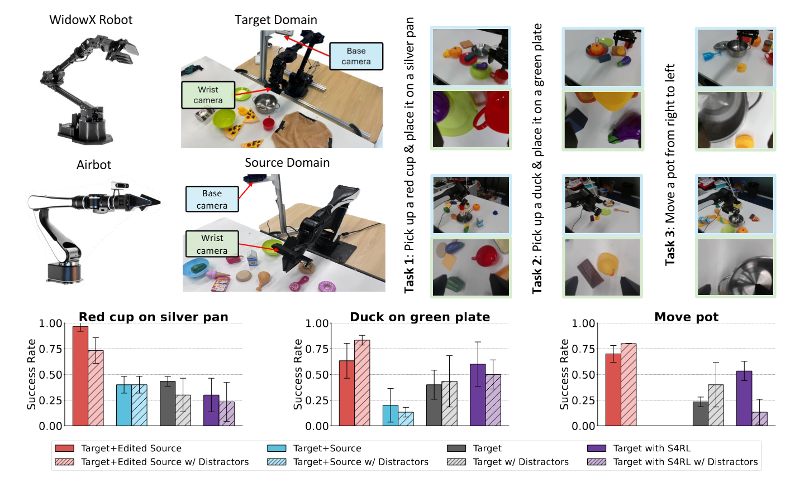

# xTED: Cross-Domain Adaptation via Diffusion-Based Trajectory Editing



Reusing pre-collected data from different domains is an appealing solution for decision-making tasks that have insufficient data in the target domain but are relatively abundant in other related domains.
            Existing cross-domain policy transfer methods mostly aim at learning domain correspondences or corrections to facilitate policy learning, such as learning domain/task-specific discriminators, representations, or policies. This design philosophy often results in heavy model architectures or task/domain-specific modeling, lacking flexibility.
            This reality makes us wonder: can we directly bridge the domain gaps universally at the data level, instead of relying on complex downstream cross-domain policy transfer models?
            In this study, we propose the **Cross**-Domain **T**rajectory **ED**iting (**xTED**) framework that employs a specially designed diffusion model for cross-domain trajectory adaptation.
            Our proposed model architecture effectively captures the intricate dependencies among states, actions, and rewards, as well as the dynamics patterns within target data. By utilizing the pre-trained diffusion as a prior, source domain trajectories can be transformed to match with target domain properties while preserving original semantic information. 
            This process implicitly corrects underlying domain gaps, enhancing state realism and dynamics reliability in the source data, and allowing flexible incorporation with various downstream policy learning methods.
            Despite its simplicity, xTED demonstrates superior performance in extensive simulation and real-robot experiments.

## Setup the Environment

```bash
pip install -r requirements
```

## Train Diffusion Model
Train diffusion priors on target data:
```bash
python train.py --config configs/diffuser_inv_halfcheetah/diffuser_inv_halfcheetah_mdreplay.py --run_name train 
```
The saved model file would be found in `logs/`.

## Trajectory Editing
Edit source trajectories with the saved checkpoint:
```bash
python train.py --config configs/diffuser_inv_halfcheetah/diffuser_inv_halfcheetah_mdreplay.py --run_name edit  --ckpt_path path_to_ckpt --dynamic gravity --variety_degree 2.0
```

## Credit
The code is built upon a jax implementation of Decision Diffuser, [decision-diffuser-jax](https://github.com/zbzhu99/decision-diffuser-jax).

## Citation 

```
@article{niu2024xted,
  title={xTED: Cross-Domain Adaptation via Diffusion-Based Trajectory Editing},
  author={Niu, Haoyi and Chen, Qimao and Liu, Tenglong and Li, Jianxiong and Zhou, Guyue and Zhang, Yi and Hu, Jianming and Zhan, Xianyuan},
  journal={NeurIPS 2024 Workshop on Open-World Agents},
  year={2024}
}
```
