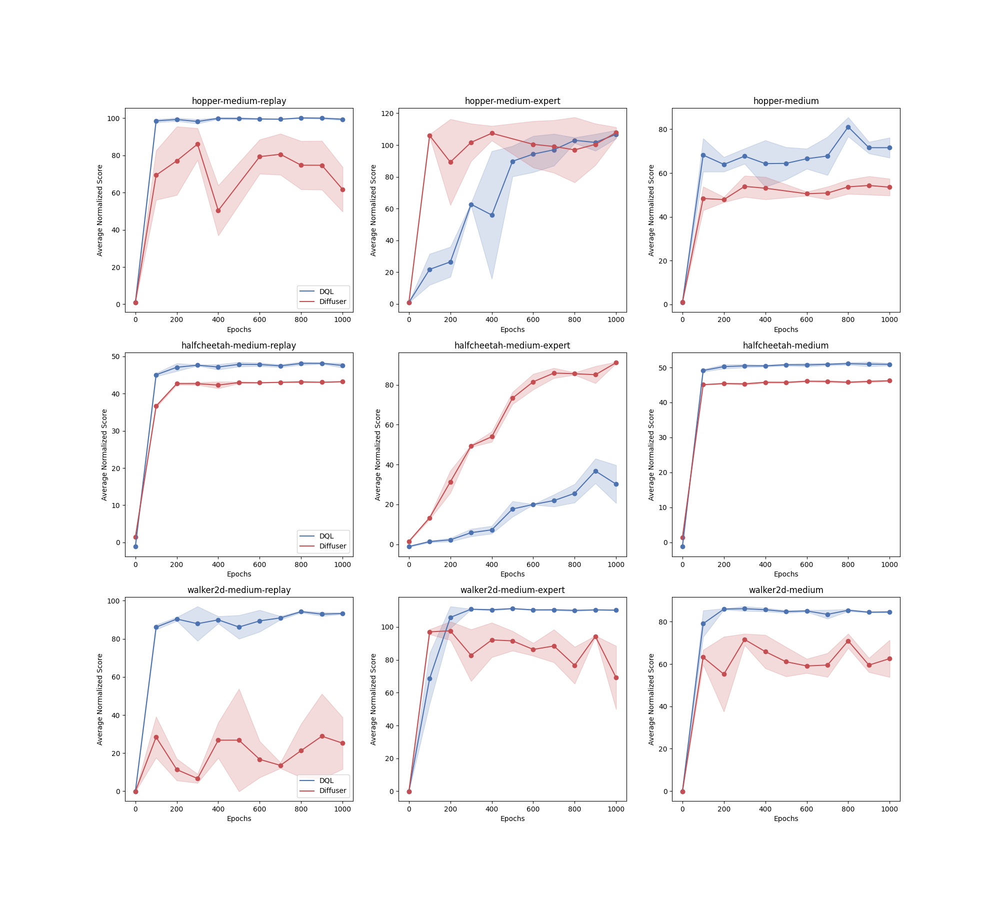

# Decision Diffuser JAX

This is a JAX implementation of [Decision Diffuser](https://arxiv.org/abs/2211.15657). The code is built upon another diffusion-based offline rl algorithm, [edp](https://arxiv.org/abs/2305.20081), which is also included in this repo.

## Setup the environment

Create python environment with conda
```bash
conda env create -f environment.yml
conda activate diffuser
pip install -e .
```

Apart from this, you'll have to setup your MuJoCo environment and key as well.

## Run Experiments

Run diffuser on d4rl hopper:

```bash
python train.py --config configs/diffuser_inv_hopper/diffuser_inv_hopper_mdexpert.py
```

Run EDP on d4rl hopper:

```bash
python train.py --config configs/dql_hopper/dql_hopper_mdexpert.py
```


## Current results on D4RL datasets



## Weights and Biases Online Visualization Integration
This codebase can also log to [W&B online visualization platform](https://wandb.ai/site). To log to W&B, you first need to set your W&B API key environment variable.
Alternatively, you could simply run `wandb login`.

## Credits
This code repo is mainly built upon [EDP](https://github.com/sail-sg/edp). We also refer to the official pytorch implementation of [decision-diffuser](https://github.com/anuragajay/decision-diffuser). The vectorized rl envionment is borrowed from [tianshou](https://github.com/thu-ml/tianshou).
